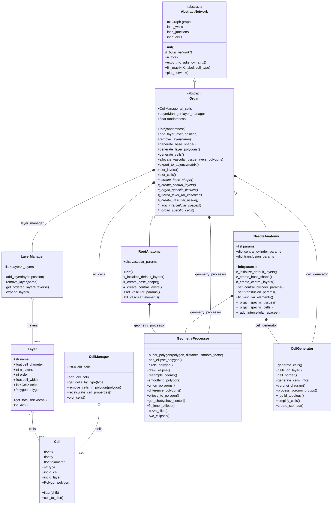

```mermaid
classDiagram
    class AbstractNetwork {
        <<abstract>>
        +nx.Graph graph
        +int n_walls
        +int n_junctions
        +int n_cells
        +__init__()
        #_build_network()*
        +n_total()
        +export_to_adjencymatrix()
        +fill_matrix(K, label, cell_type)
        +plot_network()
    }

    class Organ {
        <<abstract>>
        +CellManager all_cells
        +LayerManager layer_manager
        +float randomness
        +__init__(randomness)
        +add_layer(layer, position)
        +remove_layer(name)
        +generate_base_shape()
        +generate_layer_polygons()
        +generate_cells()
        +allocate_vascular_tissue(layers_polygons)
        +export_to_adjencymatrix()
        +plot_layers()
        +plot_cells()
        #_create_base_shape()*
        #_create_central_layers()*
        #_organ_specific_tissues()*
        #_which_layer_for_vascular()*
        #_create_vascular_tissue()*
        #_add_intercellular_spaces()*
        #_organ_specific_cells()*
    }

    class RootAnatomy {
        +dict vascular_params
        +__init__()
        #_initialize_default_layers()
        #_create_base_shape()
        #_create_central_layers()
        +set_vascular_params()
        +fit_vascular_elements()
    }

    class NeedleAnatomy {
        +list params
        +dict central_cylinder_params
        +dict transfusion_params
        +__init__(params)
        #_initialize_default_layers()
        #_create_base_shape()
        #_create_central_layers()
        +set_central_cylinder_params()
        +set_transfusion_params()
        +fit_vascular_elements()
        +_organ_specific_tissues()
        +_organ_specific_cells()
        +_add_intercellular_spaces()

    }

    class Layer {
        +str name
        +float cell_diameter
        +int n_layers
        +int order
        +float cell_width
        +list~Cell~ cells
        +Polygon polygon
        +get_total_thickness()
        +to_dict()
    }

    class Cell {
        +float x
        +float y
        +float diameter
        +str type
        +int id_cell
        +int id_layer
        +Polygon polygon
        +jitter(shift)
        +cell_to_dict()
    }

    class CellManager {
        +list~Cell~ cells
        +add_cell(cell)
        +get_cells_by_type(type)
        +remove_cells_in_polygon(polygon)
        +recalculate_cell_properties()
        +plot_cells()
    }

    class LayerManager {
        -list~Layer~ _layers
        +add_layer(layer, position)
        +remove_layer(name)
        +get_ordered_layers(reverse)
        +expand_layers()
    }

    class GeometryProcessor {
        +buffer_polygon(polygon, distance, smooth_factor)
        +half_ellipse_polygon()
        +circle_polygon()
        +draw_ellipse()
        +resample_coords()
        +smoothing_polygon()
        +union_polygons()
        +difference_polygons()
        +ellipse_to_polygon()
        +get_chebyshev_center()
        +fit_inner_ellipse()
        +pizza_slice()
        +two_ellipses()
    }

    class CellGenerator {
        +generate_cells()
        +cells_on_layer()
        +cell_border()
        +generate_cells_info()
        +voronoi_diagram()
        +process_voronoi_groups()
        +_build_topology()
        +simplify_cells()
        +create_stomata()
    }

    AbstractNetwork <|-- Organ
    Organ <|-- RootAnatomy
    Organ <|-- NeedleAnatomy
    
    Organ *-- CellManager : all_cells
    Organ *-- LayerManager : layer_manager
    Organ *-- GeometryProcessor : geometry_processor
    Organ *-- CellGenerator : cell_generator

    NeedleAnatomy *-- GeometryProcessor : geometry_processor
    NeedleAnatomy *-- CellGenerator : cell_generator

    RootAnatomy *-- GeometryProcessor : geometry_processor
    
    CellManager "1" o-- "many" Cell : cells
    LayerManager "1" o-- "many" Layer : _layers
    Layer "1" o-- "many" Cell : cells
```