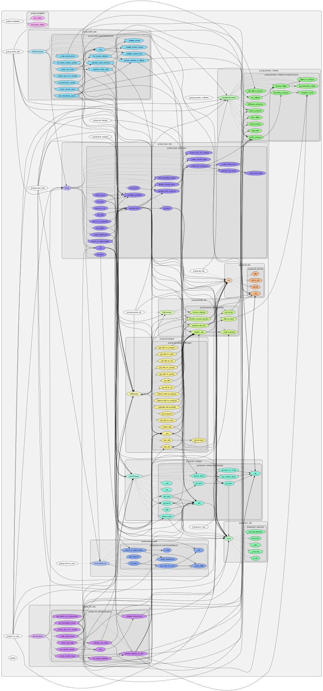

# GRANAR package translated in Python

## Installation

In GRANAP root directory, install the environment with
```bash
mamba create -f ./conda/environment.yaml -y
mamba activate granap 
```

For source to be recognized in the environment, run the following at the root of the GRANAP directory
```bash
pip install -e . 
```

Warning : 
- Intercellular space are not well implemented
- There is a problem for the polygon creation

## Code structure

For an interactive browsing, use the following link: 

Bellow is a preview

